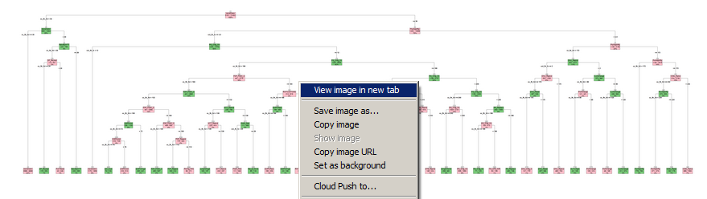
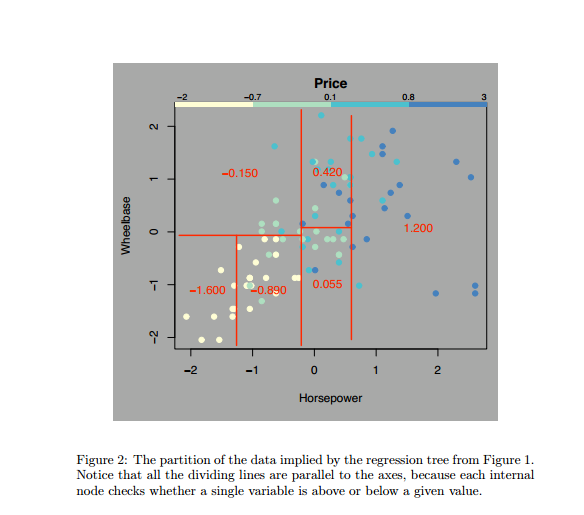

One of the question been asked before is about on how to generate the CPT. Below is the the explanation :-


The CPT ( Conditional Probability Table ) can be generated via Recursive Partitioning and Regression Trees

* Download sample Trouble Ticket using the Impala
* Sample original Trouble Ticket dataset below :-

```{r echo=TRUE ,  fig.align='center' ,   fig.height=10 , fig.width=40 ,  message=F, warning=F}
suppressWarnings(suppressMessages(library(ggplot2)))
suppressWarnings(suppressMessages(library(xlsx)))
suppressWarnings(suppressMessages(library(sentiment)))
suppressWarnings(suppressMessages(library(wordcloud)))
suppressWarnings(suppressMessages(library(RODBC)))
suppressWarnings(suppressMessages(library(pander)))
suppressWarnings(suppressMessages(library(ggmap)))
suppressWarnings(suppressMessages(library(RColorBrewer)))
suppressWarnings(suppressMessages(library(Rstem)))
suppressWarnings(suppressMessages(library(tm)))
suppressWarnings(suppressMessages(library(NLP)))
suppressWarnings(suppressMessages(library(rmarkdown)))
suppressWarnings(suppressMessages(library(gridExtra)))
suppressWarnings(suppressMessages(library(Rmisc)))
suppressWarnings(suppressMessages(library(png)))
suppressWarnings(suppressMessages(library(grid)))
suppressWarnings(suppressMessages(library(igraph)))
suppressWarnings(suppressMessages(library(RPMG)))
suppressWarnings(suppressMessages(library(Hmisc)))
suppressWarnings(suppressMessages(library(rpart)))
suppressWarnings(suppressMessages(library(rpart)))
suppressWarnings(suppressMessages(library(rpart.plot)))
suppressWarnings(suppressMessages(library(RColorBrewer)))
suppressWarnings(suppressMessages(library(party)))
suppressWarnings(suppressMessages(library(partykit)))
suppressWarnings(suppressMessages(library(caret)))
suppressWarnings(suppressMessages(library(xtable)))
suppressWarnings(suppressMessages(library(knitr)))
suppressWarnings(suppressMessages(library(ascii)))
suppressWarnings(suppressMessages(library(pander)))

# Make big tree
b <- read.csv("cat.csv")
kable(head(b), digits = 4, longtable = TRUE , format = "pandoc" , padding = 0)

```

Converting the dataset into factor which is suitable for Regression Trees. Choose only 3 independent variables. ( Assume this variables is listed after the features selection process )

```{r echo=TRUE ,  fig.align='center' ,   fig.height=10 , fig.width=40 ,  message=F, warning=F}
for(i in names(b)){
    
    num <- as.numeric(as.factor(b[,i]))
    b <- cbind(b,num)
    names(b)[names(b)=="num"] <- paste(names(b[i]),"_factor",sep = "")
    #print(paste(names(b[i]),"1",sep = ""))
}
b <- b[9:18]
b$tt_num_factor <- NULL
b$cc_before <- NULL
b$cc_before_factor <- NULL
b$ccat_before <- NULL
b$rc_before_before <- NULL
b$rc_before_factor <- NULL
b$ccat_before_factor <- NULL
b$rc_after_factor <- NULL
b$symp_before_factor <- NULL
kable(head(b), digits = 4, longtable = TRUE , format = "pandoc" , padding = 0)

```

Using the `RPart` and applied to the sample dataset of the Trouble Ticket for all 21k+ sample records with selected 3 independent variables below :- 

```{r echo=TRUE ,  digits = 4 , fig.align='center' ,   fig.height=10 , fig.width=40 ,message=F, warning=F}

names(b)


```

# Conditional Probablity Table 

Process Flow applied and generate Conditional Probablity Table below :-

* Generate graph template
* Applying `rpart` , method as `class` type 
* Applying minimum split size = 300 , to reduce tree size
* Reading the tree frame data
* Calculate the percentage as new set
* Bind with the tree frame data
* The `blank` space in `var` is the `<leaf>` or the split point of the regression tree

```{r echo=TRUE ,  digits = 4 , fig.align='center' ,   fig.height=10 , fig.width=40 ,  message=F, warning=F}


form <- as.formula(as.factor(b$rc_after)~ .)
tree.1 <- rpart(form,data=b,control=rpart.control(minsplit=300,cp=0), method = "class" )
cpt <-  as.data.frame(tree.1$frame)
cpt1 <-  as.data.frame((as.double(cpt$n)- as.double(cpt$dev))/as.double(cpt$n)*100)
names(cpt1) = "percentage"
cpt <-  cbind(as.data.frame(tree.1$frame),cpt1)
cpt$var <- as.character(cpt$var)
cpt$percentage <- as.character(cpt$percentage)
kable(cpt, digits = 4, longtable = TRUE , format = "pandoc" , padding = 0)
kable(print(head(cpt[,1:8])), digits = 4, longtable = TRUE , format = "pandoc" , padding = 0)

```

# Generate Regression Tree Model

Below is the Regression Tree Model generated  :-

Please right click to the image and open in the new tab.



```{r echo=TRUE ,  fig.align='center' ,   fig.height=10 , fig.width=40 ,  message=F, warning=F}
# 
#plot(tree.1)					# Will make a mess of the plot
#text(tree.1)
# 
# heat.tree <- function(tree, low.is.green=FALSE, ...) { # dots args passed to prp
# y <- tree$frame$yval
# if(low.is.green)
# y <- -y
# max <- max(y)
# min <- min(y)
# cols <- rainbow(99, end=.36)[
# ifelse(y > y[1], (y-y[1]) * (99-50) / (max-y[1]) + 50,
# (y-min) * (50-1) / (y[1]-min) + 1)]
# 
# prp(tree,varlen=10,uniform = T, branch.lty=4 ,extra=100, type = 1 , cex = 0.5, branch.col=cols, box.col=cols, ...)
# 
# 
# }
# 
# heat.tree(tree.1)
# col <- c("#FD8D3C", "#FD8D3C", "#FD8D3C", "#BCBDDC","#FDD0A2", "#FD8D3C", "#BCBDDC")
prp(tree.1, extra = 102, under=F , type = 4 , cex = 0.7,varlen=10 , fallen.leaves=T, branch.lty=1, yesno = T, box.col=c("pink", "palegreen3"),faclen=0,round = 0, space = 0,uniform = T, tweak=.8 , nn=TRUE )	# Will plot the tree

```

# Regression Tree Prediction (Training / Testing)

* Split the sample dataset into 70/30 split size
* 70% Training
* 30% Testing
* Sample `test` dataset below :-


```{r echo=TRUE ,  fig.align='center' ,   fig.height=10 , fig.width=40 ,  message=F, warning=F}

trainIndex <- createDataPartition(as.factor(b$rc_after), p=0.70, list=FALSE)
data_train <- b[ trainIndex,]
data_test <- b[-trainIndex,]
kable(head(data_test), digits=2 , format = "html" , padding = 0)

```

<br>
* Testing the Regression Tree with the `test` dataset
* The results shows the `Predicted Variable` with the corrected `prediction frequency` 
* Prediction results below :-

```{r kable}
gx <- as.data.frame(table(predict(tree.1, data_test, type = "class")))
kable(gx, digits=2 , format = "html" , padding = 0)

```

# Kena buat niee   



# Next update 

* Prediction via SVM

http://www.r-bloggers.com/text-mining-the-complete-works-of-william-shakespeare/

Try buat visualization nie..........

Dan buat dendogram mcm nie...

http://www.r-bloggers.com/clustering-the-words-of-william-shakespeare/


