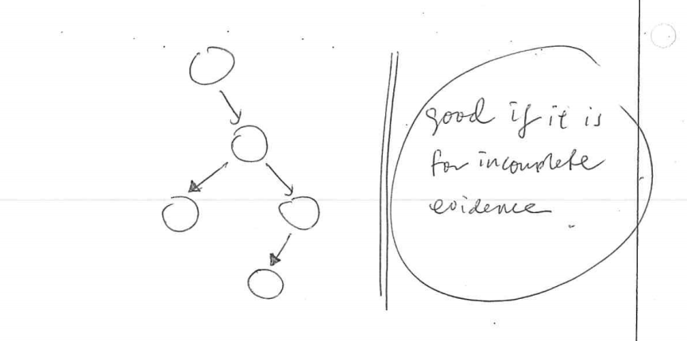
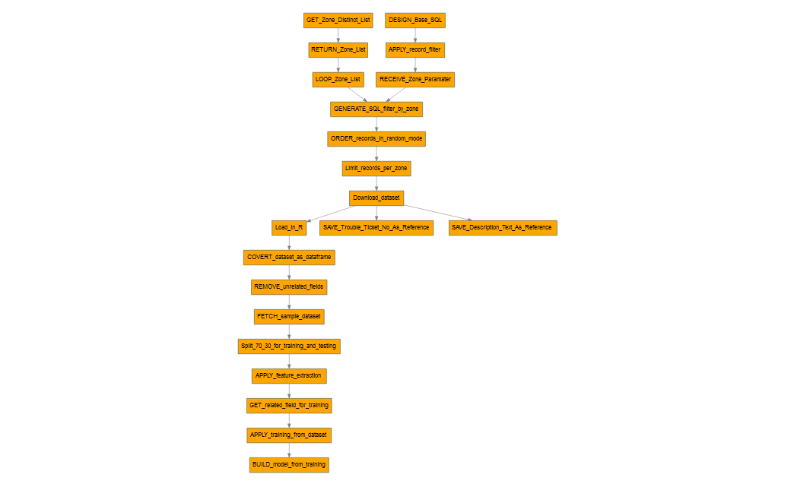

* Why use Bayesian Net in this research ?
    
1.  To look for the root cause - the dataset is in factor type which is status not a number.
2.  To find out the probabilistic relationship between the symptom error code and the resolution
3.  Most of the dataset is in factor format which status / state.
4.  Thus, with this structure we can learn and predicts the outcome by learning the relationship between the elements.

 

<div id="1">1</div>


Below is the list of literature review regarding Bayesian Net for root cause analysis :-


| Citation|Method| Output|Conclusions|
|-------------:|------------:|-------------:|-------------:|
|TroubleMiner: Mining network trouble tickets Medem, A. ; Akodjenou, M.-I ; Teixeira, R. 20091|Trouble tickets classification |*  Automation process on clustering the free text inside the description of the trouble tickets. * Choosing the correct keywords for the analysis|Using term frequency distance between trouble tickets and similarity between clusters|
|Knowledge Discovery from Trouble Ticketing Reports in a Large Telecommunication Company Temprado, Y. ; Garcia, C. ; Molinero, F.J. 2009|Data Mining , Text Mining and Machine Learning , Bayes Net, Naïve Bayes|Prediction on the next action of trouble tickets ,Different snapshots were added to the machine learning algorithm for training|Combination of multiple method to construct the recommendation , Using Bayesian for prediction|
|A Bayesian Approach To Stochastic Root Finding 2011|<i>in progress</i>|<i>in progress</i>|<i>in progress</i>|
|A Fully Bayesian Approach For Unit Root Testing 2011 |<i>in progress</i>|<i>in progress</i>|<i>in progress</i>|
|Online Root-Cause Analysis Of Alarms In Discrete Bayesian 2014|<i>in progress</i>|<i>in progress</i>|<i>in progress</i>|
|Documents Categorization Based On Bayesian Spanning Tree 2006|<i>in progress</i>|<i>in progress</i>|<i>in progress</i>|
|Benefits of a Bayesian Approach to Anomaly and Failure 2009|<i>in progress</i>|<i>in progress</i>|<i>in progress</i>|


# Process on gathering the dataset

* Acquiring dataset for 100 records, for each zone , randomize , selective year ; ie . 2015
* Rules :-

| Rules|Description|
|-------------:|------------:|
| status = 'Closed'|Dataset must be closed for complete information|
| network_tt_id is NULL |Dataset must be not related to Network Trouble Ticket|
| trouble ticket type <> PASSIVE |Trouble Ticket must related to the Active elements such as routers, switches , modem , etc|
| installed_date is NOT NULL  |This field must have value|
| created_date is NOT NULL  |This field must have value|
| closed_date is NOT NULL  |This field must have value|
| closed_date is NOT NULL  |This field must have value|
| product is NOT NULL  |This field must have value|
| sub_product is NOT NULL  |This field must have value|
| length description > 10  |This field is useful for text analysis |
| rand()  | Record selection is in random mode |
| zone  | Should selective from different zone , sparse  |

For sample purpose - selecting dataset from `ZONE KEPONG` for the analysis due to this zone has the <b>highest records</b> inside the Trouble Ticket dataset.

* Using Impala for the data retrieval  :-

Documentation - https://github.com/piersharding/dplyrimpaladb

* Data processing using DplyrImpalaDb 
* Package installation manual below :-

```r
install.packages(c("RJDBC", "devtools", "dplyr"))
devtools::install_github("jwills/dplyrimpaladb")
install.packages("dplyrimpaladb")
```
* Basic notes why choosing Impala.

1.  Cloudera 'Impala', which is a massively parallel processing (MPP) SQL query engine runs natively in Apache Hadoop
2.  Impala's Place in the Big Data Ecosystem
3.  Flexibility for Big Data Workflow
4.  High-Performance Analytics

# Connection to Impala 

Basic Impala drivers can be downloaded from https://github.com/Mu-Sigma/RImpala/blob/master/impala-jdbc-cdh5.zip

Below is the components required and how to set the class path for the Impala drivers , RJava , RJDBC and dplyr

```{r}

setwd("D:/Google Drive/PHD/Progress/phdprogress1")
suppressWarnings(suppressMessages(library("rJava")))
suppressWarnings(suppressMessages(library("RJDBC")))
suppressWarnings(suppressMessages(library("dplyr")))
suppressWarnings(suppressMessages(library("caret")))
suppressWarnings(suppressMessages(library("corrplot")))
suppressWarnings(suppressMessages(library("lazy")))
suppressWarnings(suppressMessages(library("dplyrimpaladb")))
suppressWarnings(suppressMessages(library("rpart")))
suppressWarnings(suppressMessages(library("DiagrammeR")))
suppressWarnings(suppressMessages(library("klaR")))
suppressWarnings(suppressMessages(library("corrplot")))
suppressWarnings(suppressMessages(library("readxl")))
suppressWarnings(suppressMessages(library("tools")))
suppressWarnings(suppressMessages(library("Rgraphviz")))
suppressWarnings(suppressMessages(library("SnowballC")))
suppressWarnings(suppressMessages(library("tm")))


#add the class path for Impala jar 
.jaddClassPath(c(list.files(paste(getwd(),"/lib",sep = ''),pattern="jar$",full.names=T)))
#add the class path for JVM
.jinit(classpath = c(list.files(paste(getwd(),"/lib",sep = ''),pattern="jar$",full.names=T)))
#add the class path for dplyr library
dplyr.jdbc.classpath = c(list.files(paste(getwd(),"/lib",sep = ''),pattern="jar$",full.names=T))
conn <- src_impaladb(dbname='nova', host='10.54.1.151')

```

* Available zone list which can contribute to the dataset

```{r}
result <-  tbl(conn, sql("select zone from nova.nova_trouble_ticket where zone <> 'null' group by zone order by zone limit 1000"))
as.data.frame(result)
```

So , i can replace the SQL `like '%ZONE __________ %'` with the zone list above and apply `limit 100` for each group of the zone. Each group combined via `UNION ALL` operation.

Example below :-


* Trouble Ticket Data Dictionary as reference

```{r}
result <-  tbl(conn, sql("select * from nova_trouble_ticket where zone <> 'null' limit 1"))
as.data.frame(apply(as.data.frame(result),2,class))

```

# Getting the dataset from Impala 

Sample dataset - Selection trouble tickets only from <b>Zone Kepong</b>. The SQL is define by :-

* Why Kepong zone ? 

`Zone Kepong` contains very rich information especially for the textual analysis and also one of the largest composition of the cause code & the resolution code which is good for the supervised learning. 

<div id="dataset rules"></div>

| Rules|Description|
|-------------:|------------:|
| a.status like '%Closed%'|Dataset must be closed for complete information|
| network_tt_id = 'null' |Dataset must be not related to Network Trouble Ticket|
| trouble ticket type <> PASSIVE |Trouble Ticket must related to the Active elements such as routers, switches , modem , etc. Excluding for now if related to the `3rd party` causes , `customer behavior` and `Passive` elements |
| installed_date is NOT NULL  |This field must have value|
| created_date is NOT NULL  |This field must have value|
| closed_date is NOT NULL  |This field must have value|
| closed_date is NOT NULL  |This field must have value|
| product is NOT NULL  |This field must have value|
| sub_product is NOT NULL  |This field must have value|
| length description > 10  |This field is useful for text analysis |
| rand()  | Record selection is in random mode |
| zone  | Should selective from different zone , sparse control  |


Generated SQL :-

```r
select * from nova_trouble_ticket a join active_code b on (trim(a.cause_code) = trim(b.cause_code)) join exchange_zone c ON (trim(a.exchange)=trim(c.building_id)) and (b.code <> 'PASSIVE' ) where c.zone_name like '%ZONE KEPONG%' and a.status like '%Closed%'  and length(a.cause_category) > 1  and length(a.created_date) > 6 and length(a.closed_date) > 6 and length(a.installed_date) > 6 and a.package_name not like '%null%' and a.product not like '%null%' and a.sub_product not like '%null%'  and  length(a.description) > 10 and network_tt_id = 'null' order by rand() limit 10000 "
```

# Dataset filtering 

<div id="dataset filtering"></div>

Removing non-related fields such as trouble ticket key , trouble ticket number , trouble ticket date etc.

```{r}

conn <- src_impaladb(dbname='nova', host='10.54.1.151')

result <-  tbl(conn, sql("select a.tt_row_id,a.tt_num,a.tt_type,a.tt_sub_type,a.status,a.severity,a.important_message,a.appointment_flag,a.nova_account_name,a.nova_subscriber_num,a.nova_account_num,a.package_row_id,a.created_by,a.category,a.symptom_error_code,a.priority,a.product,a.sub_product,a.package_name,a.network_tt_id,a.swap_order_num,a.cause_category,a.cause_code,a.resolution_code,a.closure_category,a.resolution_team,a.service_affected,a.service_order_num,a.btu_type,a.owner,a.owner_name,a.group_owner,a.owner_position,a.btu_platform,a.dp_location,a.created_date,a.pending_verify_date,a.closed_by,a.closed_date,a.source,a.installed_date,a.description,a.repeat_ticket_count,a.follow_up_ticket_count,a.fdp_device_name,
a.fdp_site_name,a.olt_site_name,a.exchange,a.`timestamp`,a.contact_id,a.contact_name,a.contact_office_phone,a.contact_mobile_phone,a.contact_home_phone,a.contact_email_addr,a.due_date,a.part_num,a.network_layer,a.network_row_id,a.asset_id,a.ptt,a.zone,a.service_point_id , c.zone_name, c.district,c.state, c.region from nova_trouble_ticket a join active_code b on (trim(a.cause_code) = trim(b.cause_code)) join exchange_zone c ON (trim(a.exchange)=trim(c.building_id)) and (b.code <> 'PASSIVE' ) where c.zone_name like '%ZONE KEPONG%' and a.status like '%Closed%' and  length(a.cause_category) > 1 and length(a.created_date) > 6 and length(a.closed_date) > 6 and length(a.installed_date) > 6 and a.package_name not like '%null%' and a.product not like '%null%' and a.sub_product not like '%null%' and  length(a.description) > 10 and a.network_tt_id = 'null' order by rand() limit 100"))

result <- as.data.frame(result)

```

Close the connection from Impala

```{r}
x <- conn$con
class(x) <- c('JDBCConnection')
dbDisconnect(x)

```

Save the class as the data.frame 

```{r}

df <- as.data.frame(result)
df_tm <- as.data.frame(result)
df$contact_name <- NULL
df$contact_home_phone <- NULL
df$contact_email_addr <- NULL
df$contact_office_phone <- NULL
df$contact_mobile_phone <- NULL
df$`tt_row_id` <- NULL
df$`tt_num` <- NULL
df$tt_type <- NULL
df$`created_date` <- NULL
df$`closed_date` <- NULL
df$`installed_date` <- NULL
df$timestamp <- NULL
df$service_point_id <- NULL
df$contact_id <- NULL
df$owner_position <- NULL
df$tt_sub_type <- NULL
df$severity <- NULL
df$status <- NULL
df$important_message <- NULL
df$network_tt_id <- NULL
df$swap_order_num <- NULL
df$appointment_flag <- NULL
df$nova_account_name <- NULL
df$nova_subscriber_num <- NULL
df$nova_account_num <- NULL
df$repeat_ticket_count <- NULL
df$follow_up_ticket_count <- NULL
df$service_order_num <- NULL
df$source <- NULL
df$owner_name <- NULL
df$description <- NULL
df$due_date <- NULL
df$part_num <- NULL
df$zone <- NULL
df$ptt <- NULL
df$asset_id <- NULL
df$network_layer <- NULL
df$network_row_id <- NULL
df$pending_verify_date <- NULL
df$package_row_id <- NULL
df$priority <- NULL
summary(df)

```

Looping the columns name and rename it to [column name]+1 as the factor name


```{r}


for(i in names(df)){

  num <- as.numeric(as.factor(df[,i]))
  df <- cbind(df,num)
  names(df)[names(df)=="num"] <- paste(names(df[i]),"_factor",sep = "")
  print(paste(names(df[i]),"1",sep = ""))
}

df <- df[27:52]
names(df)
write.csv(df,"ctt2014_small.csv")

```

<b>Remove</b> the predictors column which might have one unique value which can leads to <b>zero variance</b> result

The list below is non-zero variance variables

```{r}
df <- df[,-nearZeroVar(df)] 
names(df)

```

# Finding Correlation

Find the correlation between the variables using <b>Pearson</b>.

```{r}
correlations <- cor(df, use="pairwise.complete.obs", method="pearson")
print(correlations)
```


Find the <b>highest correlated</b> variables.

| Rules|Description|
|-------------:|------------:|
| <b>- +.70 or higher</b>|<b>Very strong relationship</b>|
| - +.40 to +.69|Strong positive relationship|
| - +.30 to +.39|Moderate relationship|
| - +.20 to +.29|weak  relationship|
| - +.01 to +.19|No or negligible relationship|


```{r}
# Choose 0.7 Very strong relationship
highlyCorrelated <- findCorrelation(correlations, 0.7 ,verbose = FALSE,names = TRUE)
highlyCorrelated
```

Summary of the correlated variables.

```{r}
summary(correlations)
```

Plot correlated variables.

```{r}
png(height=1200, width=1200, pointsize=15, file="corrplot.png")
corrplot(correlations, method = "number",tl.cex = 0.9 ,addCoef.col="grey", order = "AOE")
dev.off()
```


# Feature selection

Feature selection process to confirm which variable does become the independent and <b>resolution code</b> is the dependent variable via GBM (Stochastic Gradient Boosting).

List of other available model - http://topepo.github.io/caret/modelList.html


```{r}
set.seed(777)
suppressWarnings(suppressMessages(library(mlbench)))
control <-
trainControl(method = "repeatedcv", number = 5)
model <-
train(
resolution_code_factor ~ ., data = df, method = "gbm", preProcess = "scale", trControl =
control , verbose = FALSE
)
importance <- varImp(model, scale = TRUE)
print(importance)
plot(importance)
```
<div id="feature"></div>


So far , the main variables or factors found are :-

*   cause_code_factor       
*   resolution_team_factor 
*   cause_category_factor  
*   fdp_device_name_factor 
*   owner_factor            
*   created_by_factor        
*   service_affected_factor 
*   dp_location_factor       
*   btu_type_factor          

as based on the list the importance plot after the tuning and  fitting predictive model process. 


After the status = Closed inside the trouble ticket dataset.


Still need to discuss about this. Why we need this dataset ?


I still do not know when the best time to train the dataset.
The dataset keep updating every day when :-

* The ticket is created
* The ticket is closed
* The ticket has new description filled by the technician during the investigation

I recommend that the dataset need to train for <b>every week </b> because of the size and the velocity of the dataset.

The Bayes model might need to rebuild if the prediction level become lower of the treshold ; i.e < <b>60% accuracy</b>

Basically below is how i acquire the dataset as mention during the previous proposal defense below :-


<br>

And this is how the implementation will be in the future :-


# Prediction

Anyway , this is the basic on how i train the sample dataset ( only for `Kepong Zone` ) using NaiveBayes and make the prediction of the resolution code :-

<div id="bayes"></div>

```{r}
col_names <- names(df)
df[,col_names] <- lapply(df[,col_names] , factor)
names(df)
# split 70/30 from dataset into training and testing
trainIndex <- createDataPartition(df$resolution_code_factor, p=0.70, list=FALSE)
data_train <- df[ trainIndex,]
data_test <- df[-trainIndex,]
# train a naive bayes model
model <- NaiveBayes(as.factor(resolution_code_factor)~., data=data_train)
# make predictions
predictions <- suppressWarnings(suppressMessages(predict(model, data_test)))
# summarize results by predicting resolution code using the test dataset -> data_test
cm <- suppressWarnings(suppressMessages(confusionMatrix(predictions$class, data_test$resolution_code_factor)))
cm 
```

Based on the dataset from Kepong zone , we manage to get the prediction level up to <b>more than 80%</b>


So far , I'm only using the 70/30 data partition and also we also can consider to do the cross validattion sampling

Below is the option for 70/30 partition

```r
trainIndex <- createDataPartition(df$resolution_code_factor, p=0.70, list=FALSE)
```
Below is the option for 10 folds of cross validation

```r
trainControl(method = "repeatedcv", number = 10, repeats = 3)

```


Mention <a href="#dataset filtering">here</a> on how to clean and filter the data via the SQL statement using Impala


The sample dataset have been converted into a factor and been applied <a href="#bayes">here</a> 

Sample dataset after converted into factor which is required by the Bayes algorithm :-

```{r}
head(df)
```


Done that <a href="#bayes">here</a>  and how to select the independent variables been mention <a href="#feature">here</a> via the rank of the important factor


I'm still working on the other method such as Random Forest , GBM and RPart. We need to discuss on this


Tried before on how to do the feature selection via Generalized Boosted Regression <a href="#feature">here</a>


I'm thinking on clustering the cause code & the resolution code because of the unique count each of them is around

* Cause code -> 1900++ unique value
* Resolution code -> 1900++ unique value
* Symptom Error code -> 400++ unique value

I also have some reference on the category of the cause code. So far the cause code can be divided into :-

* 3RD PARTY
* Active  <- `I'm only choose this type because most Trouble Ticket is related to the Active elements type`
* CORE
* CPE
* CU
* Customer
* IPTV
* IW
* NETWORK
* Network
* NFF
* NGN/Switch
* NTT
* Others
* Passive
* RADAS

So the clustering of the cause code & resolution is needed to reduce the size and become more manageble. So we can find the relationship among the variables.


Need to disucss and I will do this later


Need to discuss on this



Need to discuss on this


# Data Cleansing & Transformation 

```{r}
# workflow <- print(grViz("
# digraph neato  {
# 
# 
# ratio = \"fill\";
# size=\"8.3,11.7!\";
# margin=0;
# 
# # graph attributes
# graph [overlap = true, fontsize = 10]
# 
# node [shape = box,style = filled,
#         fontname = Arial,
#         color = darkslategray , fillcolor = orange]
# 
# # edge statements
# edge [color = grey]
# GET_Zone_Distinct_List -> RETURN_Zone_List -> LOOP_Zone_List -> GENERATE_SQL_filter_by_zone; DESIGN_Base_SQL ->
# APPLY_record_filter -> RECEIVE_Zone_Paramater -> GENERATE_SQL_filter_by_zone ->
# ORDER_records_in_random_mode -> Limit_records_per_zone -> Download_dataset -> Load_in_R->COVERT_dataset_as_dataframe->REMOVE_unrelated_fields->FETCH_sample_dataset->Split_70_30_for_training_and_testing->APPLY_feature_extraction->GET_related_field_for_training->APPLY_training_from_dataset->BUILD_model_from_training;
# Download_dataset-> SAVE_Trouble_Ticket_No_As_Reference;
# Download_dataset-> SAVE_Description_Text_As_Reference;
# }
# "),engine = "neato")
# c<- grVizOutput(workflow)

```


* Process Workflow (in Progress)





The example shows the process workflow 

* Method

Previously have been mentioned <a href="#dataset filtering">here</a> by applying SQL and condition rules <a href="#dataset rules">here</a>


# Text Mining and Category Identification

During my last proposal defense , i proposed to develop the dictionary vector as the enrichment source for the trouble ticket prediction and also to identify the category of the messages.


I have done some simple code in R to demonstrate this :-

```{r}
df_tm <- data.frame(df_tm$description , stringsAsFactors = TRUE)
mycorpus <- Corpus(DataframeSource(df_tm))
# remove all unrelated char/text
tdm <- TermDocumentMatrix(mycorpus, control = list(weight = weightTfIdf  ,
removePunctuation = TRUE, stopwords = TRUE , removeNumbers = TRUE , stemming  = FALSE))
# remove sparse term
#z <- m[c("oil", "zone"),
tdm <- removeSparseTerms(tdm, sparse= 0.8 )
# Generate the dictionary vector limit by 10 docs
c <- suppressWarnings(suppressMessages(inspect(tdm[,1:10])))
# Plotting the relationship between words
plot(tdm, corThreshold = 0.2, weighting = TRUE)


```

So this dictionary vector can be used in the future to add on to the current dataset as the new variables.

```{r}
 # disable this code due to lots of messages appears
 # transpose_tdm<- invisible(as.data.frame(inspect(t(tdm[,]))))
 # disable this code due to lots of messages appears
 # cause_code_tdm <- cbind(cbind(df$tt_row_id,df$cause_code),transpose_tdm[1:10,1:10])
 # write to CSV
 # write.csv(cause_code_tdm,"transpose_tdm.csv")
 transpose_tdm <- read.csv("transpose_tdm.csv")  
 head(transpose_tdm)
```

We need to discuss this further.


---------

# Journal 1 - Paper

Still in progress.

Submission date ?


-----------


# Journal 2 - Paper

Still in progress. Need to discuss.

Submission date ?


-----------

# Journal 3 - Paper

Still in progress. Need to discuss.

Submission date ?


```
resolution_code_factor = 11.0994418236953 + 0.0271059467010067*cause_code_factor^2 + 0.591034895263412*cause_code_factor*cos(5.25933893689746 + 1.41594294552768*cause_category_factor) + 2.25382870641884*cos(5.25933893689746 + 1.41594294552768*cause_category_factor)/(cause_code_factor - sin(1.4261748752851 + sin(cause_code_factor))) - 2.42425680899875*cause_category_factor

resolution_code_factor = 6.1973445964827 + 0.0202471489336383*cause_code_factor^2 + 0.0205230813400532*cause_code_factor^2*cos(cause_category_factor) - 3.57914338755998*cos(cause_category_factor) - 9.63624311198358*cos(5.90793635573745*cos(cause_category_factor))

```


