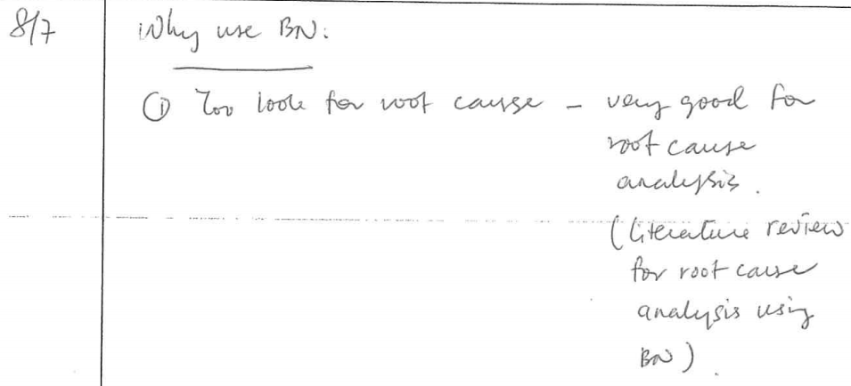
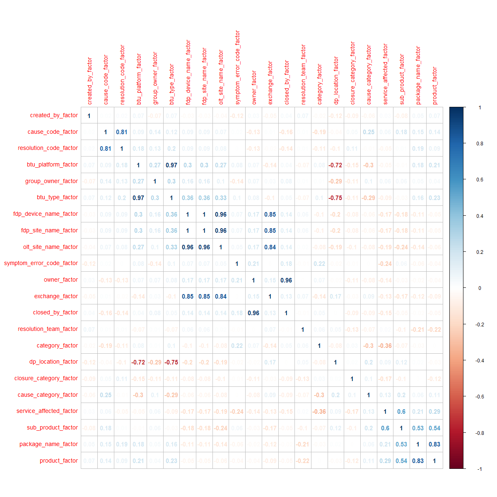
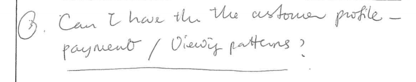
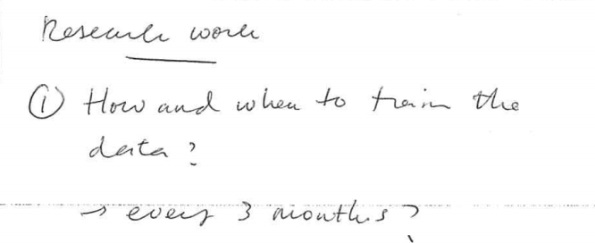
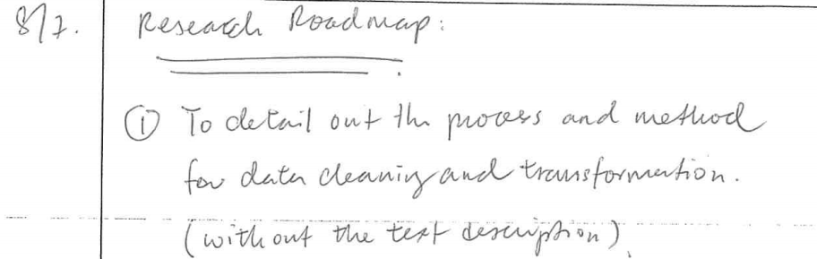

* Why use Bayesian Net ?
    
1.  To look for the root cause - the dataset is in factor type which is status not a number.
2.  To find out the probabilistic relationship between the symptom error code and the resolution
3.  

 

<div id="1">1</div>

| Citation|Method| Output|Conclusions|
|-------------:|------------:|-------------:|-------------:|
|TroubleMiner: Mining network trouble tickets Medem, A. ; Akodjenou, M.-I ; Teixeira, R. 20091|Trouble tickets classification |*  Automation process on clustering the free text inside the description of the trouble tickets. * Choosing the correct keywords for the analysis|Using term frequency distance between trouble tickets and similarity between clusters|
|Knowledge Discovery from Trouble Ticketing Reports in a Large Telecommunication Company Temprado, Y. ; Garcia, C. ; Molinero, F.J. 2009|Data Mining , Text Mining and Machine Learning , Bayes Net, Naïve Bayes|Prediction on the next action of trouble tickets ,Different snapshots were added to the machine learning algorithm for training|Combination of multiple method to construct the recommendation , Using Bayesian for prediction|
|A Bayesian Approach To Stochastic Root Finding 2011|x|x|x|
|A Fully Bayesian Approach For Unit Root Testing 2011 |x|x|x|
|Online Root-Cause Analysis Of Alarms In Discrete Bayesian 2014|x|x|x|
|Documents Categorization Based On Bayesian Spanning Tree 2006|x|x|x|
|Benefits of a Bayesian Approach to Anomaly and Failure 2009|x|x|x|


List of literature review regarding Bayesian Net :-

1.A real-life application of multi-agent systems for fault diagnosis in the provision of an Internet business service

2.A Bayesian Network approach to diagnosing the root cause of failure 

3.sss


# Process on gathering the dataset

* Acquiring dataset for 100 records, for each zone , randomize , selective year ; ie . 2015
* Rules :-

| Rules|Description|
|-------------:|------------:|
| status = 'Closed'|Dataset must be closed for complete information|
| network_tt_id is NULL |Dataset must be not related to Network Trouble Ticket|
| trouble ticket type <> PASSIVE |Trouble Ticket must related to the Active elements such as routers, switches , modem , etc|
| installed_date is NOT NULL  |This field must have value|
| created_date is NOT NULL  |This field must have value|
| closed_date is NOT NULL  |This field must have value|
| closed_date is NOT NULL  |This field must have value|
| product is NOT NULL  |This field must have value|
| sub_product is NOT NULL  |This field must have value|
| length description > 10  |This field is useful for text analysis |
| rand()  | Record selection is in random mode |
| zone  | Should selective from different zone , sparse  |

For sample purpose - selecting dataset from `ZONE KEPONG` for the analysis due to this zone has the <b>highest records</b> inside the Trouble Ticket dataset.

* Using Impala for the data retrieval  :-

Documentation - https://github.com/piersharding/dplyrimpaladb

* Data processing using DplyrImpalaDb 
* Package installation manual below :-

```r
install.packages(c("RJDBC", "devtools", "dplyr"))
devtools::install_github("jwills/dplyrimpaladb")
install.packages("dplyrimpaladb")
```
* Basic notes why choosing Impala.

1.  Cloudera 'Impala', which is a massively parallel processing (MPP) SQL query engine runs natively in Apache Hadoop
2.  Impala's Place in the Big Data Ecosystem
3.  Flexibility for Big Data Workflow
4.  High-Performance Analytics

# Connection to Impala 

Basic Impala drivers can be downloaded from https://github.com/Mu-Sigma/RImpala/blob/master/impala-jdbc-cdh5.zip

Below is the components required and how to set the class path for the Impala drivers , RJava , RJDBC and dplyr

```{r}


suppressWarnings(suppressMessages(library("rJava")))
suppressWarnings(suppressMessages(library("RJDBC")))
suppressWarnings(suppressMessages(library("dplyr")))
suppressWarnings(suppressMessages(library("caret")))
suppressWarnings(suppressMessages(library("corrplot")))
suppressWarnings(suppressMessages(library("lazy")))
suppressWarnings(suppressMessages(library("dplyrimpaladb")))
suppressWarnings(suppressMessages(library("rpart")))


.jaddClassPath(c(list.files(paste(getwd(),"/lib",sep = ''),pattern="jar$",full.names=T)))

.jinit(classpath = c(list.files(paste(getwd(),"/lib",sep = ''),pattern="jar$",full.names=T)))

dplyr.jdbc.classpath = c(list.files(paste(getwd(),"/lib",sep = ''),pattern="jar$",full.names=T))

conn <- src_impaladb(dbname='nova', host='10.54.1.151')

```

* Zone list

```{r}
result <-  tbl(conn, sql("select zone from nova.nova_trouble_ticket where zone <> 'null' group by zone order by zone limit 1000"))
as.data.frame(result)
```


* Trouble Ticket Data Dictionary

```{r}
result <-  tbl(conn, sql("select * from nova_trouble_ticket where zone <> 'null' limit 1"))
as.data.frame(apply(as.data.frame(result),2,class))

```

# Getting the dataset from Impala 

Sample dataset - Selection trouble tickets only from <b>Zone Kepong</b>. The SQL is define by :-

* Why Kepong zone ? 

`Zone Kepong` contains very rich information especially for the textual analysis and also one of the largest composition of the cause code & the resolution code which is good for the supervised learning. 

| Rules|Description|
|-------------:|------------:|
| a.status like '%Closed%'|Dataset must be closed for complete information|
| network_tt_id = 'null' |Dataset must be not related to Network Trouble Ticket|
| trouble ticket type <> PASSIVE |Trouble Ticket must related to the Active elements such as routers, switches , modem , etc. Excluding for now if related to the `3rd party` causes , `customer behavior` and `Passive` elements |
| installed_date is NOT NULL  |This field must have value|
| created_date is NOT NULL  |This field must have value|
| closed_date is NOT NULL  |This field must have value|
| closed_date is NOT NULL  |This field must have value|
| product is NOT NULL  |This field must have value|
| sub_product is NOT NULL  |This field must have value|
| length description > 10  |This field is useful for text analysis |
| rand()  | Record selection is in random mode |
| zone  | Should selective from different zone , sparse control  |


Generated SQL :-

```r
select * from nova_trouble_ticket a join active_code b on (trim(a.cause_code) = trim(b.cause_code)) join exchange_zone c ON (trim(a.exchange)=trim(c.building_id)) and (b.code <> 'PASSIVE' ) where c.zone_name like '%ZONE KEPONG%' and a.status like '%Closed%'  and length(a.cause_category) > 1  and length(a.created_date) > 6 and length(a.closed_date) > 6 and length(a.installed_date) > 6 and a.package_name not like '%null%' and a.product not like '%null%' and a.sub_product not like '%null%'  and  length(a.description) > 10 and network_tt_id = 'null' order by rand() limit 10000 "
```

# Datset filtering 

Removing non-related fields such as trouble ticket key , trouble ticket number , trouble ticket date etc.

```{r}

conn <- src_impaladb(dbname='nova', host='10.54.1.151')

result <-  tbl(conn, sql("select a.tt_row_id,a.tt_num,a.tt_type,a.tt_sub_type,a.status,a.severity,a.important_message,a.appointment_flag,a.nova_account_name,a.nova_subscriber_num,a.nova_account_num,a.package_row_id,a.created_by,a.category,a.symptom_error_code,a.priority,a.product,a.sub_product,a.package_name,a.network_tt_id,a.swap_order_num,a.cause_category,a.cause_code,a.resolution_code,a.closure_category,a.resolution_team,a.service_affected,a.service_order_num,a.btu_type,a.owner,a.owner_name,a.group_owner,a.owner_position,a.btu_platform,a.dp_location,a.created_date,a.pending_verify_date,a.closed_by,a.closed_date,a.source,a.installed_date,a.description,a.repeat_ticket_count,a.follow_up_ticket_count,a.fdp_device_name,
a.fdp_site_name,a.olt_site_name,a.exchange,a.`timestamp`,a.contact_id,a.contact_name,a.contact_office_phone,a.contact_mobile_phone,a.contact_home_phone,a.contact_email_addr,a.due_date,a.part_num,a.network_layer,a.network_row_id,a.asset_id,a.ptt,a.zone,a.service_point_id , c.zone_name, c.district,c.state, c.region from nova_trouble_ticket a join active_code b on (trim(a.cause_code) = trim(b.cause_code)) join exchange_zone c ON (trim(a.exchange)=trim(c.building_id)) and (b.code <> 'PASSIVE' ) where c.zone_name like '%ZONE KEPONG%' and a.status like '%Closed%' and  length(a.cause_category) > 1 and length(a.created_date) > 6 and length(a.closed_date) > 6 and length(a.installed_date) > 6 and a.package_name not like '%null%' and a.product not like '%null%' and a.sub_product not like '%null%' and  length(a.description) > 10 and a.network_tt_id = 'null' order by rand() limit 100"))

result <- as.data.frame(result)

```

Close the connection from Impala

```{r}
x <- conn$con
class(x) <- c('JDBCConnection')
dbDisconnect(x)

```

Save the class as the data.frame 

```{r}

df <- as.data.frame(result)
df$contact_name <- NULL
df$contact_home_phone <- NULL
df$contact_email_addr <- NULL
df$contact_office_phone <- NULL
df$contact_mobile_phone <- NULL
df$`tt_row_id` <- NULL
df$`tt_num` <- NULL
df$tt_type <- NULL
df$`created_date` <- NULL
df$`closed_date` <- NULL
df$`installed_date` <- NULL
df$timestamp <- NULL
df$service_point_id <- NULL
df$contact_id <- NULL
df$owner_position <- NULL
df$tt_sub_type <- NULL
df$severity <- NULL
df$status <- NULL
df$important_message <- NULL
df$network_tt_id <- NULL
df$swap_order_num <- NULL
df$appointment_flag <- NULL
df$nova_account_name <- NULL
df$nova_subscriber_num <- NULL
df$nova_account_num <- NULL
df$repeat_ticket_count <- NULL
df$follow_up_ticket_count <- NULL
df$service_order_num <- NULL
df$source <- NULL
df$owner_name <- NULL
df$description <- NULL
df$due_date <- NULL
df$part_num <- NULL
df$zone <- NULL
df$ptt <- NULL
df$asset_id <- NULL
df$network_layer <- NULL
df$network_row_id <- NULL
df$pending_verify_date <- NULL
df$package_row_id <- NULL
df$priority <- NULL
summary(df)

```

Looping the columns name and rename it to [column name]+1 as the factor name


```{r}


for(i in names(df)){

  num <- as.numeric(as.factor(df[,i]))-1
  df <- cbind(df,num)
  names(df)[names(df)=="num"] <- paste(names(df[i]),"_factor",sep = "")
  print(paste(names(df[i]),"1",sep = ""))
}

df <- df[27:52]
names(df)

```

<b>Remove</b> the predictors column which might have one unique value which can leads to <b>zero variance</b> result

The list below is non-zero variance variables

```{r}
df <- df[,-nearZeroVar(df)] 
names(df)

```

Find the correlation between the variables using <b>Pearson</b>.

```{r}
correlations <- cor(df, use="pairwise.complete.obs", method="pearson")
print(correlations)
```


Find the <b>highest correlated</b> variables.

| Rules|Description|
|-------------:|------------:|
| <b>- +.70 or higher</b>|<b>Very strong relationship</b>|
| - +.40 to +.69|Strong positive relationship|
| - +.30 to +.39|Moderate relationship|
| - +.20 to +.29|weak  relationship|
| - +.01 to +.19|No or negligible relationship|


```{r}
# Choose 0.7 Very strong relationship
highlyCorrelated <- findCorrelation(correlations, 0.7 ,verbose = FALSE,names = TRUE)
highlyCorrelated
```

Summary of the correlated variables.

```{r}
summary(correlations)
```

Plot correlated variables.

```{r}
png(height=1200, width=1200, pointsize=15, file="corrplot.png")
corrplot(correlations, method = "number",tl.cex = 0.9 ,addCoef.col="grey", order = "AOE")
dev.off()
```


Feature selection process to confirm which variable does become the independent and <b>resolution code</b> is the dependent variable via GBM (Stochastic Gradient Boosting).

List of other available model - http://topepo.github.io/caret/modelList.html


```{r}
set.seed(777)
suppressWarnings(suppressMessages(library(mlbench)))
control <- trainControl(method = "repeatedcv", number = 10, repeats = 3)
model <-
train(
resolution_code_factor ~ ., data = df, method = "gbm", preProcess = "scale", trControl =
control , verbose = FALSE
)
importance <- varImp(model, scale = TRUE)
print(importance)
plot(importance)
```


The main variables / factors are :-

*   cause_code_factor       
*   resolution_team_factor 
*   cause_category_factor  
*   fdp_device_name_factor 
*   owner_factor            
*   created_by_factor        
*   service_affected_factor 
*   dp_location_factor       
*   btu_type_factor          

as listed from the importance plot


sss



sss




sss


sss


sss



<p><a href="#1">1</a></p>
